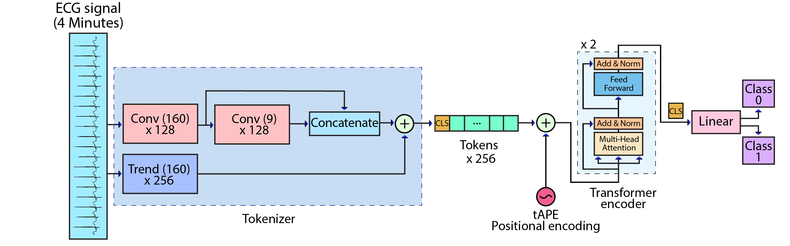

# TMFormer 

TMFormer (Trend-Augmented Multiscale Tokenization Transformer) is a Transformer-based time-series classification model designed for brain injury classification as part of my PhD research. The model was trained and evaluated on private clinical data; therefore, the dataset and trained model cannot be shared due to data privacy restrictions. Full details and experimental results are available in my paper, **"Classification of Hypoxic Ischemic Encephalopathy (HIE) in Neonates Using ECG and a Transformer-Based Model,"** published in IEEE Access (2026).

> Available at: https://ieeexplore.ieee.org/abstract/document/11381441

## Method Summary

TMFormer introduces a tokenization approach derived from raw ECG signal attributes, capturing spatial patterns at multiple scales while modeling the signal's long-term temporal progression. The model incorporates a learnable class token and tAPE positional encoding, followed by a Transformer encoder that predicts the brain injury class.



## Highlights

- Transformer-based classifier for fixed-length 1D signals.
- Convolutional token embedding before the Transformer attention blocks.
- Training pipeline with AdamW, cosine annealing learning rate scheduling, warmup, and gradient clipping.
- Early stopping based on validation loss.
- Evaluation using accuracy, AUROC, F1 score, confusion matrix, and ROC curves.
- Saves both the best validation checkpoint and the final trained model.
- MLOps practices including configuration-driven experiments, reproducible seeding, patient-level train/test splitting to prevent data leakage, Weights & Biases experiment tracking, model artifact saving, structured result outputs, and GPU/CPU-aware training.

## Data Format

The training script expects a dataset directory containing two subdirectories: `train` and `test`. These must contain data from completely different patients to ensure subject-independent evaluation and prevent data leakage.

Each directory should contain `.pt` files. Every file is expected to store a dictionary with at least the following keys:

- `signal`: Input tensor for a single sample.
- `class`: Binary label for the sample.

## Project Structure

1. `dataset_builder.py` loads `.pt` files containing signal tensors and labels.
2. `model.py` implements the TMFormer architecture.
3. `train.py` trains the model and selects the best checkpoint based on validation AUROC.
4. `test.py` evaluates the trained model and saves prediction outputs and ROC curves.
5. `main.py` runs the complete training and evaluation pipeline.

## How to Run

1. Install the required dependencies from `requirements.txt`.
2. If using a CUDA-enabled GPU, install the appropriate PyTorch version for your CUDA toolkit.
3. Specify the dataset path using the `--data_dir` argument (or update the default in `main.py`).
4. Run the training pipeline:

```bash
python main.py --data_dir "C:\path\to\data" --info_dir parameters/my_params.json --save_dir "saved files\run_01"
```
